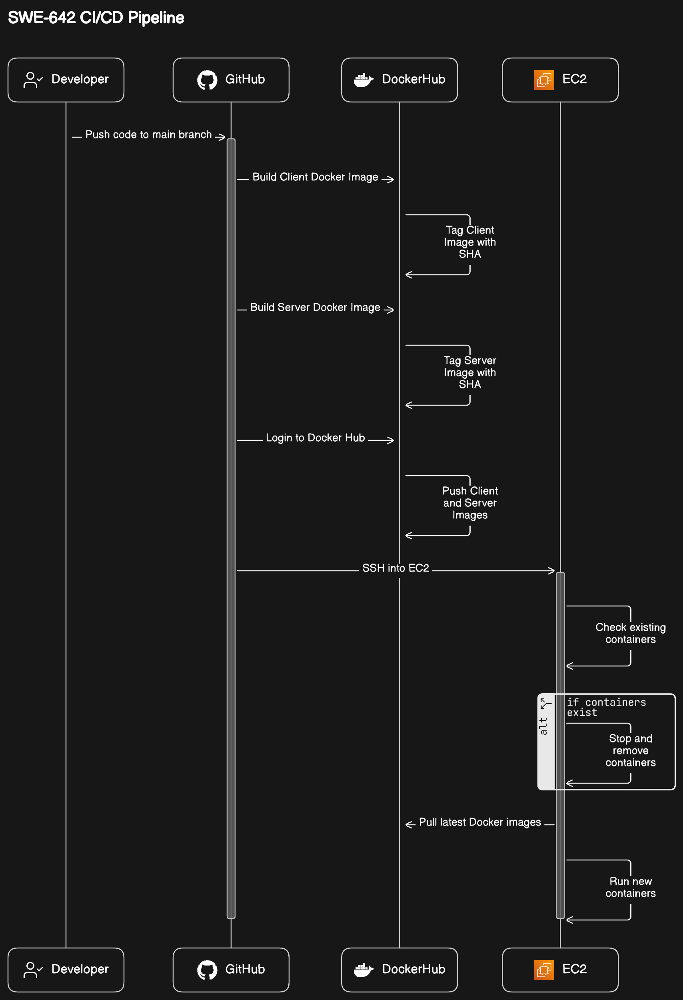
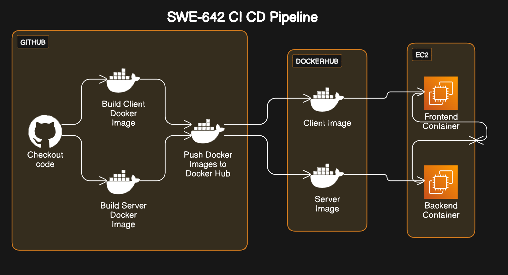

# Project Name: SWE-642 CI/CD Pipeline with Angular Frontend and Spring Boot Backend

## Application Workflow

## Devops CI-CD Pipleine Workflow

## Overview

This is a **MonoRepo** project which sets up a continuous integration and continuous deployment (CI/CD) pipeline for a web application. The application consists of a frontend developed using Angular and a backend developed using Spring Boot. The CI/CD pipeline is orchestrated using GitHub Actions, and the application is deployed on AWS EC2 instance with Docker containers. The database used is Amazon RDS with MySQL.

## Hosting

The application is hosted on http://ec2-18-235-217-2.compute-1.amazonaws.com:4200/

## Components

1. **Frontend**: The frontend of the application is built using Angular, a modern web development framework. It provides a user interface for interacting with the application.

2. **Backend**: The backend of the application is developed using Spring Boot, a popular Java-based framework for building robust and scalable web applications. It handles the business logic and data processing for the application.

3. **Database**: The database used is RDS MySQL, a managed relational database service provided by AWS. It stores the application data securely and reliably.

4. **GitHub Actions Workflow**: The CI/CD pipeline is defined using GitHub Actions. It automates the build, testing, and deployment process whenever code changes are pushed to the main branch of the GitHub repository.

5. **Docker Containers**: Both the frontend and backend applications are packaged as Docker containers for easy deployment and portability. These containers are orchestrated using Docker on AWS EC2 instance.

6. **Cleanup Script**: The cleanup.sh script stops and removes existing Docker containers and images related to the application.

7. **Development/Test Script**: The dev-test.sh script cleans up existing containers and images and then builds and runs new containers for both the frontend and backend components in a development or test environment.

8. **EC2 Instance**: The Docker containers are deployed and run on AWS EC2 instance. The frontend container is exposed on port 4200, while the backend container is exposed on port 8080.

## Workflow Description

1. **Code Checkout**: The GitHub Actions workflow begins by checking out the code from the main branch of the GitHub repository.

2. **Build Docker Images**: Docker images for the frontend and backend applications are built using the provided Dockerfiles. Each image is tagged with the Git commit SHA to ensure version control.

3. **Push Docker Images to Docker Hub**: The built Docker images are pushed to Docker Hub for storage and distribution. This allows easy access to the images during deployment.

4. **SSH into EC2 and Pull Latest Docker Images**: The workflow SSHes into the configured EC2 instance using provided credentials. It then stops and removes any existing containers, pulls the latest Docker images from Docker Hub, and runs new containers for both frontend and backend applications.

5. **Deployment**: The frontend application is accessible via port 4200, and the backend application is accessible via port 8080 on the EC2 instance.

## Setup Instructions

1. Clone the GitHub repository to your local machine.
2. Ensure you have Docker installed and configured on your local machine.
3. Update the GitHub Actions workflow file with your Docker Hub credentials and EC2 SSH key.
4. Push your code changes to the main branch of the GitHub repository to trigger the CI/CD pipeline.
5. For Angular Production Mocking on Local use Command: ng serve --configuration production

## Contributors

- **Mohnish Raval** - G01373613
- **FNU Niharika** - G01412073
- **Syedfurkhan Feroz Hashmi** - G01411748

## License

This project is licensed under the MIT License
